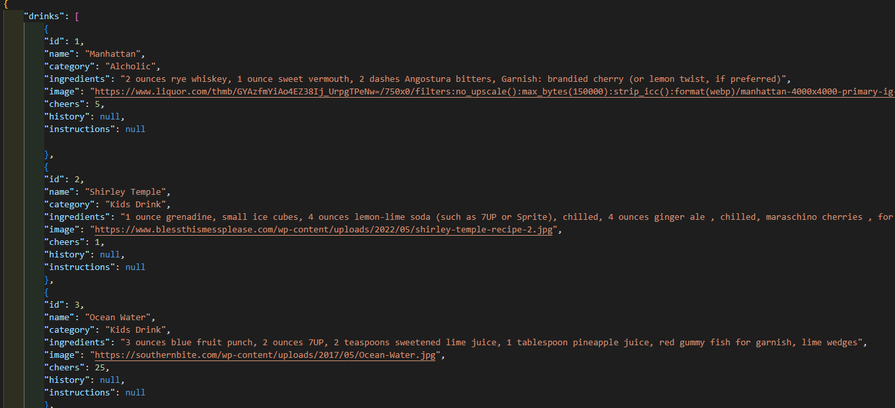
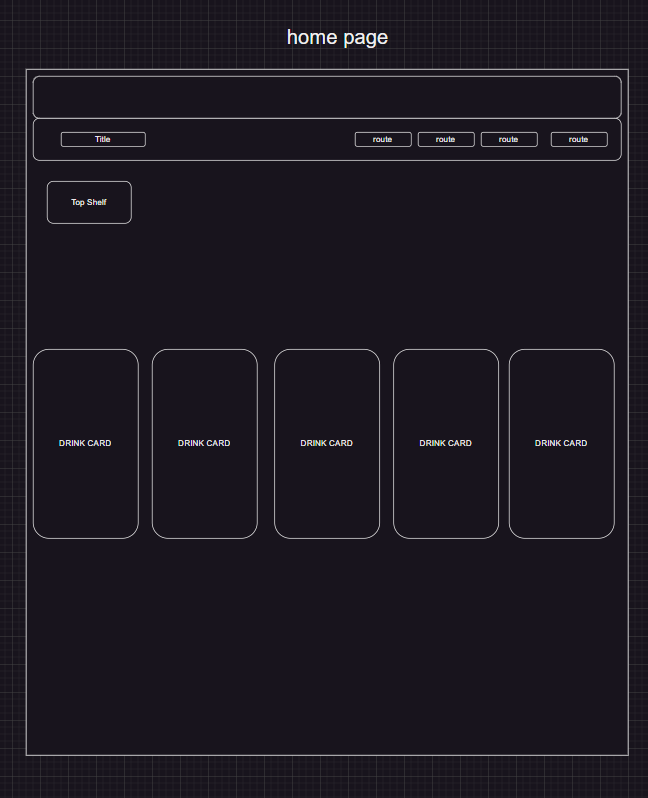
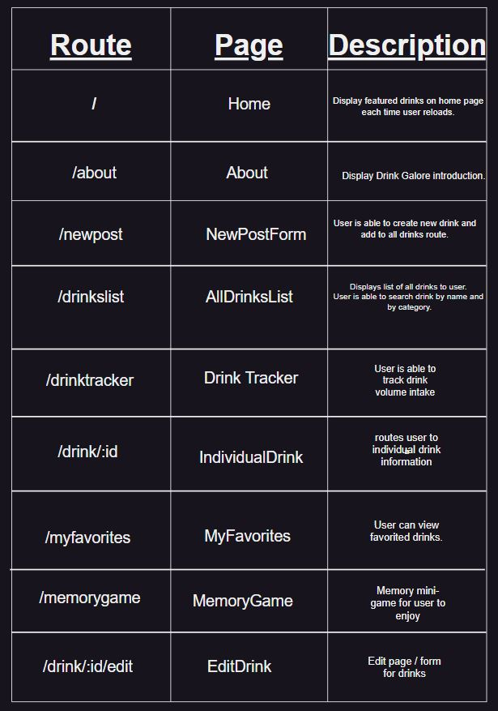
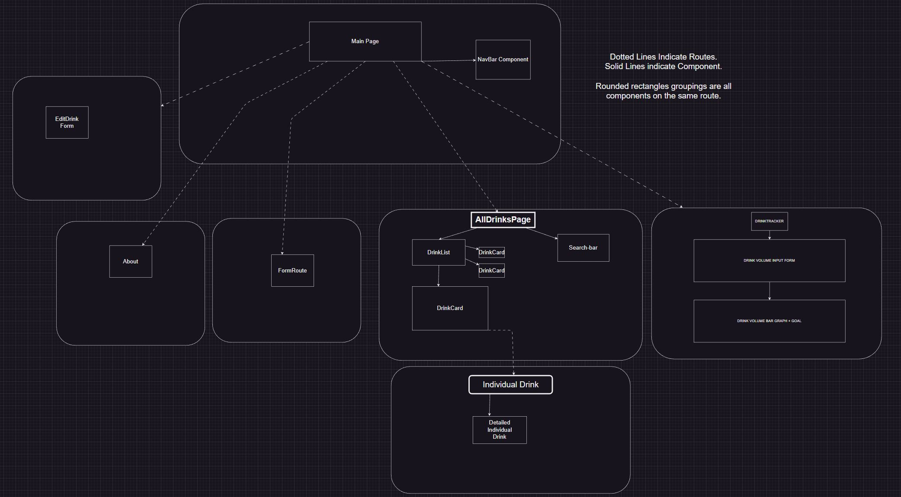
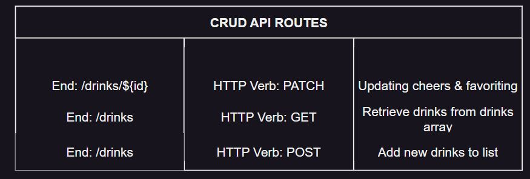
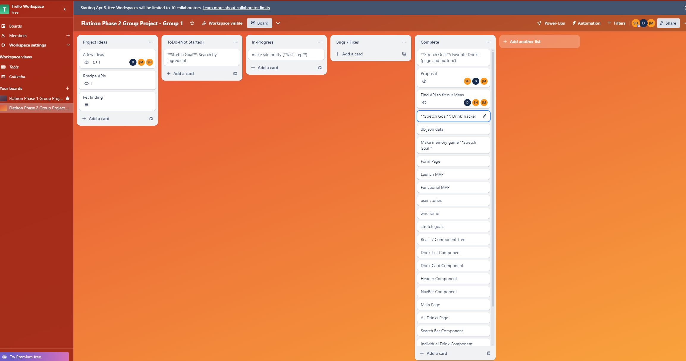

# Drinks Galore 

### A Dynamic Drinks Glossary
Drinks galore is a dynamic drinks glossary for beverage lovers. Find your favorite beverages and explore new drink options with Drinks Galore.

## Instructions
* Please be sure you have __tailwindcss__ for vite installed.
* Here is the install command if not npm install -D tailwindcss postcss autoprefixer

## Deliverables / User Stories
> As a user I can:
* View the top 5 upvoted drinks on home page.
* Add "cheers" to "upvote" drinks.
* Add drinks to "All Drinks" page with a Drink Input Form.
* Water volume daily intake tracker with standardized goal.
* Show ingredients with button "Show Ingredients".
* Favorites button with "Favorites" page that show favorited drinks.
* Drink history on "Individual Drink Page".

## Stretch Deliverables
> As a user I can:
* Implement "edit" button and form.
* Filter by least amount of upvotes to greatest vice versa
* Expand search specifics
* Add instructions
* Soundscape / atmosphere per drink category
* Make Drink Memory Game.
* Add customizable water goal.
* Add customizable water goal based on weight.

## Project Database:

## Wireframe

## Routes 

## Component Tree 

## API / JSON

## Trello Board

## Sources:
* https://en.wikipedia.org/wiki/Main_Page
* https://www.health.harvard.edu/staying-healthy/how-much-water-should-you-drink
* https://www.godairyfree.org/
* https://www.flaticon.com/

## Github Link
* https://github.com/scmh001/react-hooks-phase-2-project

## Collaborators

Jasen Miyamoto ◘ Shukri Hussein ◘ Dainis Michel

jasentm ◘ scmh001 ◘ dainiswmichel