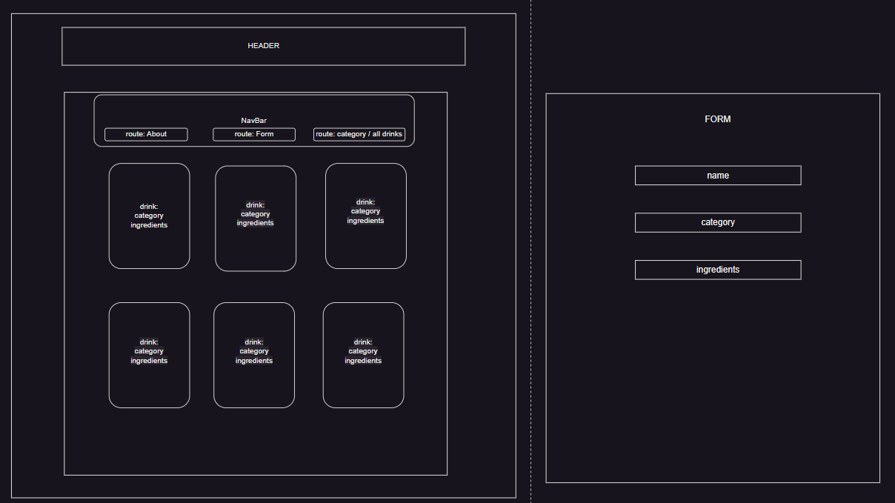
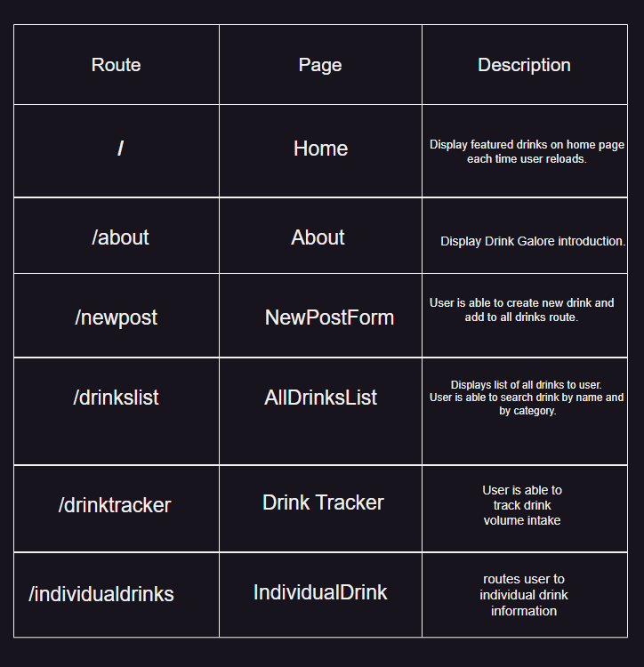
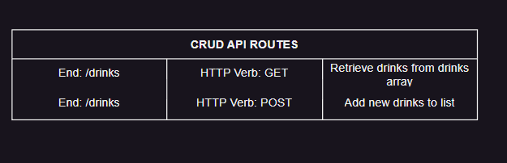
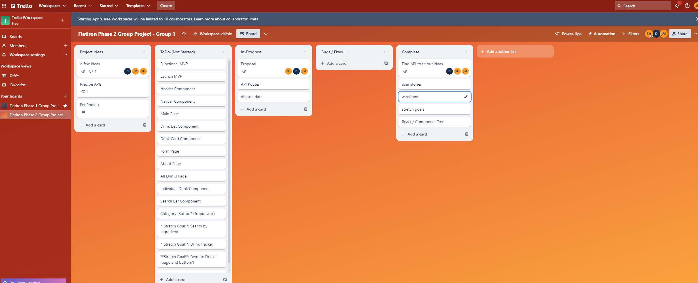

# Drinks Galore 

### A Dynamic Drinks Glossary
Drinks galore is a dynamic drinks glossary for beverage lovers. Find your favorite beverages and explore new drink options with Drinks Galore.

## Instructions
* Please be sure you have __tailwindcss__ installed

## Deliverables / User Stories
> As a user I can:
* View the top 6 upvoted drinks on home page
* Add "cheers" to "upvote" drinks
* Add drinks with a Drink Input Form
* Water volume intake tracker.
* Show ingredients with button "Show Ingredients"
* Filter by least amount of upvotes to greatest vice versa

## Stretch Deliverables
> As a user I can:
* Expand search specifics
* Add instructions
* Add drink history
* Add favorites button with favorites page
* Soundscape / atmosphere per drink category
* Make Root Beer Tapper Game

## Project Database:

## Wireframe

## Routes 

## Component Tree 

## API / JSON

## Trello Board

## Github Link
* https://github.com/scmh001/react-hooks-phase-2-project

## Collaborators

Jasen Miyamoto ◘ Shukri Hussein ◘ Dainis Michel

jasentm ◘ scmh001 ◘ dainiswmichel