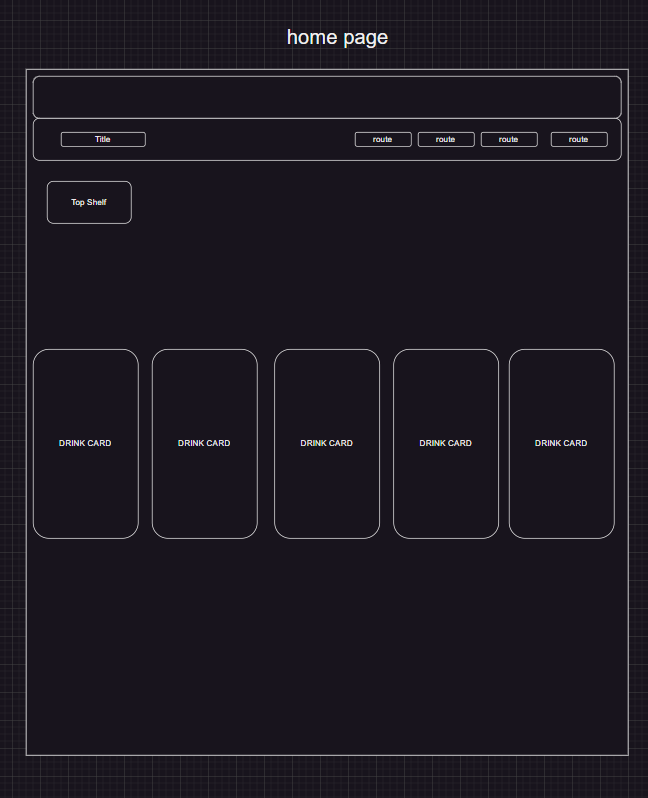

# Drinks Galore 

### A Dynamic Drinks Glossary
Drinks Galore is an innovative web application designed for beverage enthusiasts to explore, upvote, and track their favorite drinks. This project leverages the power of modern web technologies to provide a seamless and interactive experience for users. Below is a comprehensive guide to setting up, understanding, and contributing to the Drinks Galore project.

## Prerequisites 
Before you begin, ensure you have tailwindcss for Vite installed in your development environment. TailwindCSS is a utility-first CSS framework that enables rapid UI development. If you haven't installed TailwindCSS along with its dependencies, run the following command in your project directory:
>bash
>npm install -D tailwindcss postcss autoprefixer

This command installs TailwindCSS, PostCSS, and Autoprefixer as development dependencies, setting up your environment for building the Drinks Galore application.

## Deliverables / User Stories
> As a user I can:
* View the top 5 upvoted drinks on home page.
* Add "cheers" to "upvote" drinks.
* Add drinks to "All Drinks" page with a Drink Input Form.
* Daily Water volume daily intake tracker with standardized goal.
* Show ingredients with button "Show Ingredients".
* Favorites button with "Favorites" page that show favorited drinks.
* Drink history on "Individual Drink Page".

## Stretch Deliverables
> As a user I can:
* Implement "edit" button and form.
* Filter by least amount of upvotes to greatest vice versa
* Expand search specifics
* Add instructions
* Soundscape / atmosphere per drink category
* Make Drink Memory Game.
* Add customizable water goal.
* Add customizable water goal based on weight.

## Project Database:
>Dainis was able to extract some SQL data and convert it to JSON which we later converted to our database format.

## Wireframe
> The application's wireframe provides a visual guide to the UI and UX design.

## Routes 
> The application's routing structure is outlined below, ensuring efficent navigation throughout the app.

## Component Tree 
> The component tree illustrates the hierarchical structure of React components used in the project.

## API / JSON
> The application leverages a custom API, structured in JSON format, to manage and display drink data.

## Trello Board
> Project management and task tracking are facillitated through a dedicated Trello board.

## Sources:
* https://en.wikipedia.org/wiki/Main_Page
* https://www.health.harvard.edu/staying-healthy/how-much-water-should-you-drink
* https://www.godairyfree.org/
* https://www.flaticon.com/

## Github Repository
> The source code for Drinks Galore is hosted on GitHub, accessible via the following link.
* https://github.com/scmh001/react-hooks-phase-2-project

## Collaborators
> This project is a collaborative effort among the following developers:

* Jasen Miyamoto (GitHub: jasentm)
* Shukri Hussein (GitHub: scmh001)
* Dainis Michel (GitHub: dainiswmichel)
